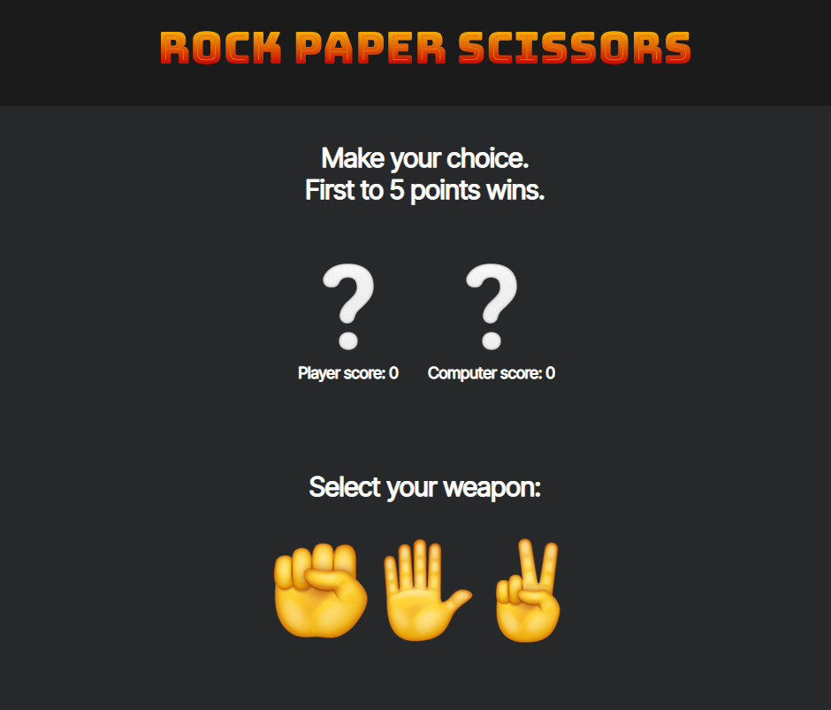

<!-- Projects -->
  <section id="projects">
    

      <!-- Card 1-->
      

        
        

          <h5 class="card-title">Rock Paper Scissors Game</h5>
          
Rock, Paper, Scissors game against the computer. First to 5 wins.

          <a href="https://saroff03.github.io/rock_paper_scissors_game/" target="_blank" class="btn btn-primary">Live Demo</a>
        

      

      <!-- Card 2-->
      

        
        

          <h5 class="card-title">Calculator</h5>
          
Simple calculator app built with JavaScript.

          <a href="https://calculatorappsarov.netlify.app/" target="_blank" class="btn btn-primary">Live Demo</a>
        

      

      <!-- Card 3-->
      

        
        

          <h5 class="card-title">Product Landing Page</h5>
          
Simple product landing page. JavaScript not included.

          <a href="https://saroff03.github.io/freeCodeCamp-Product-Landing-Page/" target="_blank" class="btn btn-primary">Live Demo</a>
        

      

    

  </section>
